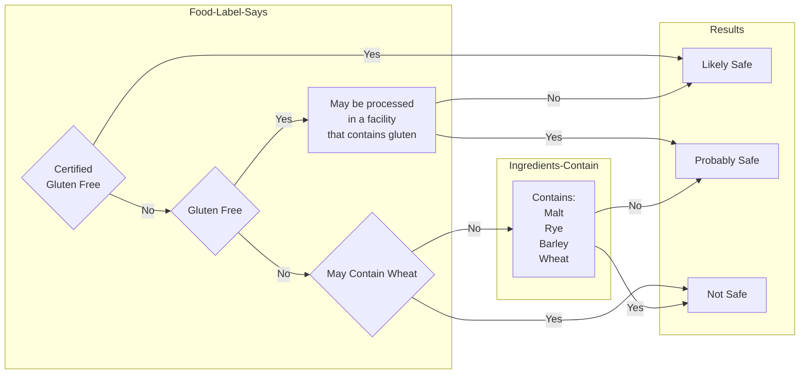

# celiac-info

```mermaid
graph LR
    subgraph Food-Label-Says
       gf
       cgf
       mbp
       mcw
    end
    subgraph Ingredients-Contain
       cmrbow
    end
    subgraph Results
       ls
       ps
       ns
    end
    cgf{Certified<br>Gluten Free} --> |Yes|ls[Likely Safe]
    cgf{Certified<br>Gluten Free} --> |No|gf
    gf{Gluten Free} --> |Yes|mbp
    mbp[May be processed<br>in a facility<br>that contains gluten] --> |Yes|ps[Probably Safe]
    mbp --> |No|ls
    gf{Gluten Free} --> |No|mcw{May Contain Wheat}
    mcw --> |No|cmrbow[Contains:<br>Malt<br>Rye<br>Barley<br>Wheat]
    mcw --> |Yes|ns
    
    cmrbow --> |No|ps
    cmrbow --> |Yes|ns[Not Safe]
```
